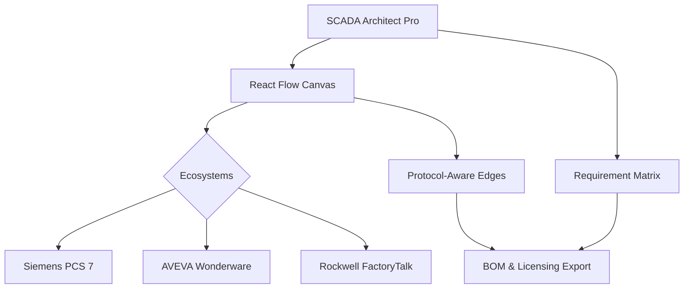
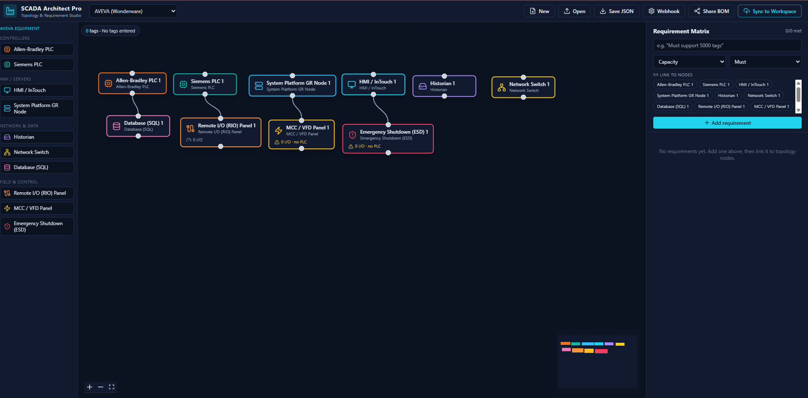

# 🏭 SCADA Architect Pro


**A visual, mobile-ready topology and requirement mapping studio engineered specifically for SCADA Systems Integrators and Automation Engineers.**

SCADA Architect Pro allows you to design industrial networks (AVEVA, Siemens, Rockwell, GE), map client requirements to physical hardware, calculate I/O rollups, and instantly generate Bill of Materials (BOM) estimates—all from a browser or as an installable offline Progressive Web App (PWA).

---

## 📊 Application Architecture



### 3. Add Your Logo and App Screenshots
To show actual pictures of your app, you need to take screenshots, save them in your `public/` folder, and link to them. 

Add this code where you want the images to appear:


<div align="center">
  <!-- Replace logo.png with your actual logo file name -->
  
</div>

## 📸 App Preview
<!-- Save a screenshot as preview.png in your public folder to make this work -->



## 🚀 Quick Start

Ensure you have Node.js installed, then clone the repository and run:

```bash
# 1. Install dependencies
npm install

# 2. Run the development server (Service worker disabled for live-reloading)
npm run dev

# 3. Test production build & PWA installability (Offline mode)
npm run build && npm run preview
```

---

## 📱 Mobile-First Design

SCADA Architect Pro is designed to go to the field with you. Install it on your tablet or smartphone directly from the browser.

| 🛠️ Features | Description |
| :--- | :--- |
| **App-Like Navigation** | Bottom tab bar separates the "Studio" canvas and "Requirements" matrix on mobile devices. |
| **Quick Add FAB** | Tap the floating `+` button to open the equipment drawer without cluttering the screen. |
| **Auto-Save & Offline** | Edits sync immediately to `localStorage`. Close the app and resume exactly where you left off. |
| **Native Sharing** | Export project JSON or BOM CSVs directly to WhatsApp, Slack, or Email via the native mobile share sheet (`navigator.share`). |

---

## ⚙️ Engineering & SCADA Features

Stop drawing static boxes. These nodes are aware of industrial protocols and hardware limits.

### 🌐 Smart Topology & Networks
*   **Node Properties:** Tap any node to assign **Name, IP Address, Hostname, and Tag Counts**. Built-in validation warns you of duplicate IP addresses.
*   **Protocol-Aware Edges:** Connections aren't just lines. Select industrial protocols (*OPC UA, Modbus TCP, Ethernet/IP, SuiteLink, S7Comm*) and Network Types (*Control, Business LAN, DMZ*). Colors automatically route based on network classification.
*   **Redundant Networking:** Toggle **"Dual Redundant Ring"** on connections to render double-lines (perfect for fibre-optic or redundant profibus architectures).

### 🏗️ Ecosystems & Hardware
*   **Multi-Platform Palettes:** Use the top dropdown to switch environments. The equipment sidebar dynamically changes for **AVEVA, Siemens WinCC/PCS 7, Rockwell FactoryTalk, or GE iFIX**.
*   **Field Device Rollup:** Drop Remote I/O (RIO), MCC/VFDs, or ESD panels onto the canvas. Assign an *I/O Count* to the panel, and it automatically aggregates up through the network switches to the nearest PLC.
*   *Need custom hardware? Edit `src/lib/ecosystems.js`.*

### 💰 Automated Licensing & BOM
*   **Live Tag Totals:** The canvas displays a running total of tags and estimates the required software license tier.
*   **Comprehensive BOM Export:** Download a CSV that includes licensing estimates, equipment summaries, detailed node properties, and protocol mapping.
*   *Licensing is indicative. To match your vendor's current price list, edit `LICENSE_TIERS` in `src/lib/scada.js`.*

---

## 🔌 API & Integration

### Sync to Workspace (Webhook)
Integrate your architecture directly into your company's estimation pipeline.

1.  Click **"Sync to Workspace"**.
2.  The app POSTs a structured JSON payload containing `nodes`, `edges`, `requirements`, ecosystem data, licensing, and I/O summaries to a webhook (e.g., n8n, Make, or Zapier).
3.  *Note: Configure your webhook URL in the settings. Ensure your automation platform has this app's origin allowed in CORS.*

---

## 🛠️ Pre-Launch Checklist

Before deploying this to your own server or GitHub Pages:
- [ ] Open `index.html` and replace `https://your-domain.example/` with your actual URL.
- [ ] Replace the placeholder PWA icons (`public/icon-192.png` and `public/icon-512.png`) with your company logo.
- [ ] Update `manifest.webmanifest` with your desired app name and theme colors.
